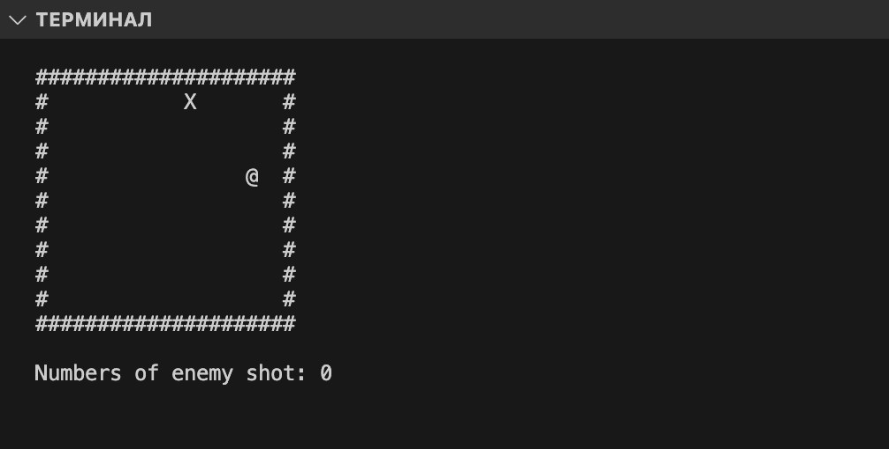

# Roguelike-0
--
Roguelike (or rogue-like) is a style of role-playing game traditionally characterized by a dungeon crawl through procedurally generated levels, turn-based gameplay, grid-based movement, and permanent death of the player character.  
--

How to build:

- Windows:

install MinGW and PDCurses. How to do it: video tutorial  
gcc -Wall -Wextra main.c -o roglik.exe -lpdcurses -static

- Linux:

install NCurses  
gcc main.c -o roglik.bin -lcurses

